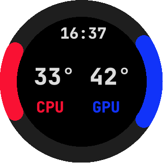
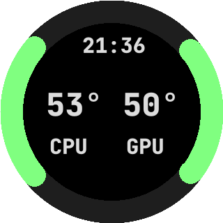

# krakenctl
Change the display on your NZXT Z73 Kraken AIO cooler in linux and windows

Krakenctl is an application written in rust, that allows users to change the display on their Z73 Kraken device.
Currently the manufacturer only provides the software for Windows users to change their display and show CPU/GPU, images etc.

This app allows linux users to update the display with whatever values they please (for example cpu and gpu temps).

### Disclaimer
This is alpha software, and may damage your device. Your cooler may stop functioning, be damaged, bricked, or stop working, which may in turn affect your other devices, most notably your CPU! Use this at your own risk. We take no responsibility for any damage to any of your devices or systems you run this on.

### How to get
Go to releases section, and download executable from there.
Or install rustup, and clone this repo, and run `cargo build --release` to build the executable.

### linux
You need to run as root, or you need to give your user permissions to access the USB device.
To do this, you can create a udev rule in `/etc/udev/rules.d/99-kraken.rules` and insert the following line:

`SUBSYSTEM=="usb", ATTRS{idVendor}=="1e71", ATTRS{idProduct}=="3008", GROUP="plugdev", TAG+="uaccess"`

Then run `reboot`

### windows
- This requires usb-1.0.lib and libusb-1.0.lib to be placed in the libusb directory (download latest).
- cargo build
- Stop nzxt cam software
- Disable cam service
- Download zadig usb driver insaller. (Use at your own risk). Select Kraken interface 0 (ONLY 0, not 1). and install winusb (this downgrades from winusb10 to winusb6)
- If windows no longer recognising the usb device after reboot:
  - turn computer off, remove power cable or turn off power supply for a few seconds, turn back on
  - boot into linux and run krakenctl there

### How to use
$ krakenctl [OPTIONS]

| Option      | Description |
| :---        | :---        |
| -b          | shows blank screen      |
| -l          | shows liquid temperature   |
| -v Valuestring      | shows value(s) and or subtitles (see below for examples)    |
| -k brightness      | sets brightness between 0-100 e.g. krakenctl -k 60 |
| -r N   | repeat every N seconds
| --script script-to-run.sh | Runs a script in the background. Ouput of script must be Valuestring. use -r 2 to run every 2 seconds |
| -d L     | shows debug info for level 0(None) 3(Info) 5(Debug)  |

- linux: krakenctl --script run.sh -r 1
- windows: krakenctl --script run.exe -r 2

To show liquid

$ krakenctl -l

To continually update values with -v option you can use a script to loop and update every few seconds.
For example if cputemp.sh is the script that returns the temperature, and you want updates every 1 second you'd use:

$ while true; do krakenctl -v "$(cputemp.sh),$(gpu.sh);CPU,GPU"; sleep 1; done;

or more efficiently with script option

$ krakenctl --script cpu-and-gpu-temp.sh -r 2

### Valuestring
Made up of 2 parts, separated by a semicolon:
- value(s)
- subtitle(s)

In addition, each of these can be optionally separated by a comma to display 2 values.
Remember if using a semicolon, you may need to use quotes to surround the Valuestring
Examples:

| Desc | value |
| :--- | :--- |
| 1 amount only | 45° |
| 2 amounts | 45°,34° |
| 1 amount with subtitle | "45°;CPU" |
| 2 amounts with subtitles | "33°,45°;CPU,GPU" |

It is recommended if using 2 amounts, to keep the amounts short, only use 2 digits and degree symbol.
Also, amounts without decimals is preferred.

### Config
To configure, you can optionally create a config file in ~/.config/krakenctl/config.ini

Download example config file above.

### Technical
krakenctl is written in rust, and uses the rusb crate which in turn uses libusb library.

### Roadmap
- [x] blank screen
- [x] liquid
- [x] values with subtitles
- [x] linux support
- [x] custom colours
- [x] windows support
- [ ] custom image
- [ ] custom animation

### Tested
| OS | Version | Status |
| :--- | :--- | :--- |
| Linux | Arch | yes  |
| Windows | 10 | yes |

### Contribute
If you find this application useful, or would like to make a contribution for continued development, you can buy me a coffee.

